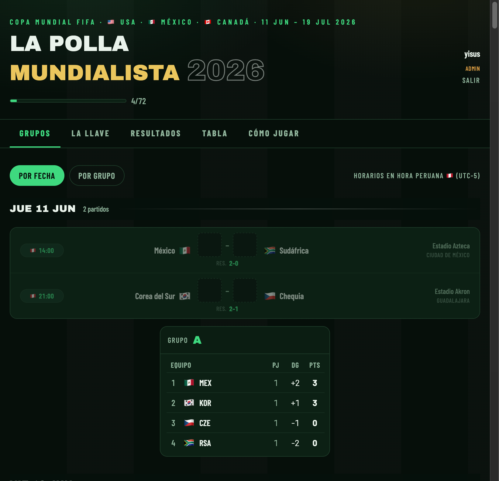

# La Polla Mundialista 2026

Polla futbolera para la Copa Mundial FIFA 2026 — pronostica los 104 partidos, arma tu bracket eliminatorio y compite contra tus compañeros en tiempo real.

**App:** https://jenriqueps.github.io/eb-fifa



---

## ¿Cómo funciona?

Cada jugador entra con su correo y recibe un **link mágico** — sin contraseña. Desde ahí puede:

- Pronosticar los marcadores de los **72 partidos de fase de grupos**
- Armar su **bracket eliminatorio** partido a partido hasta el campeón
- Ver el **ranking en tiempo real** contra los demás participantes

Los pronósticos se pueden editar hasta que **el partido inicia** (hora peruana, UTC-5). Una vez que empieza, los inputs se bloquean.

El organizador (admin) ingresa los resultados oficiales y el sistema calcula los puntos automáticamente.

---

## Pestañas

| Pestaña | Quién la usa | Qué hace |
|---------|-------------|----------|
| **Grupos** | Cada jugador | Pronostica los 72 partidos de grupos; tabla de posiciones calculada en vivo |
| **La Llave** | Cada jugador | Arma su bracket eliminatorio hasta el campeón |
| **Resultados** | Solo admin | Ingresa los marcadores y ganadores reales |
| **Tabla** | Todos | Ranking en tiempo real de quién va ganando |
| **Cómo Jugar** | Todos | Reglas y sistema de puntos |

---

## Sistema de puntos

| Acierto | Puntos |
|---------|--------|
| Marcador exacto (grupos) | **3** |
| Resultado correcto sin exacto (grupos) | **1** |
| Pronóstico en blanco | **0** |
| Ganador correcto — Octavos | **2** |
| Ganador correcto — Cuartos | **4** |
| Ganador correcto — Semis | **6** |
| Ganador correcto — 3er puesto | **8** |
| Ganador correcto — Final | **10** |
| **Máximo posible** | **338** |

---

## Stack

- **Frontend:** React 18 · Vite · Tailwind CSS v4
- **Backend:** Supabase — auth (magic links) · PostgreSQL · real-time · Edge Functions
- **Deploy:** GitHub Pages via GitHub Actions

---

## Setup local

### 1. Clonar e instalar

```bash
git clone https://github.com/JEnriquePS/eb-fifa.git
cd eb-fifa
npm install
```

### 2. Variables de entorno

```bash
cp .env.example .env.local
# Editar .env.local con tu URL y clave de Supabase
```

Las claves están en el dashboard de Supabase → **Project Settings** → **API**:
- `Project URL` → `VITE_SUPABASE_URL`
- `anon / public key` → `VITE_SUPABASE_ANON_KEY`

### 3. Configurar la base de datos

En Supabase → **SQL Editor** → ejecutar [`supabase/schema.sql`](./supabase/schema.sql).

Crea las tablas, permisos (RLS) y activa el tiempo real.

### 4. Correr la app

```bash
npm run dev    # http://localhost:5173
```

Agregar `http://localhost:5173` en Supabase → **Authentication** → **URL Configuration** → Redirect URLs.

---

## Hacer admin al organizador

Después de registrarse, ejecutar en Supabase SQL Editor:

```sql
UPDATE public.profiles SET is_admin = true
WHERE id = (SELECT id FROM auth.users WHERE email = 'tu@correo.com');
```

Solo el admin puede ingresar resultados oficiales.

---

## Deploy

La app se despliega automáticamente en **GitHub Pages** al hacer push a `main`.

Requiere dos secrets en el repositorio (Settings → Secrets → Actions):
- `VITE_SUPABASE_URL`
- `VITE_SUPABASE_ANON_KEY`

Y la URL del sitio (`https://jenriqueps.github.io/eb-fifa`) debe estar en Supabase → **Authentication** → **URL Configuration** → Redirect URLs.
