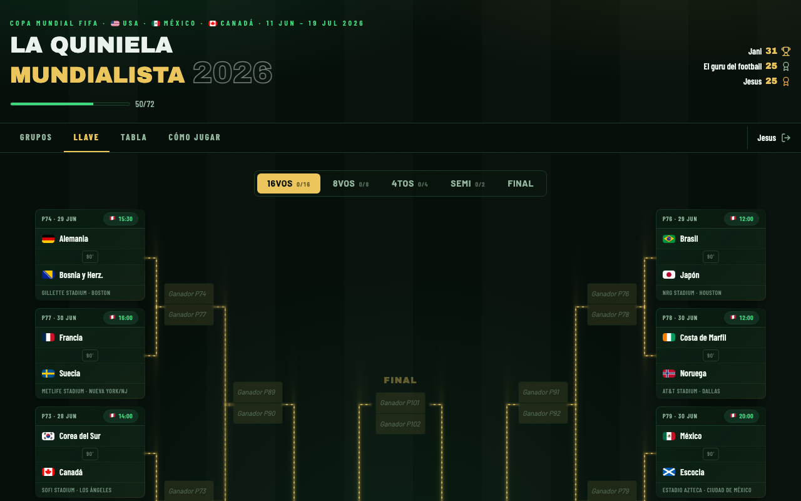
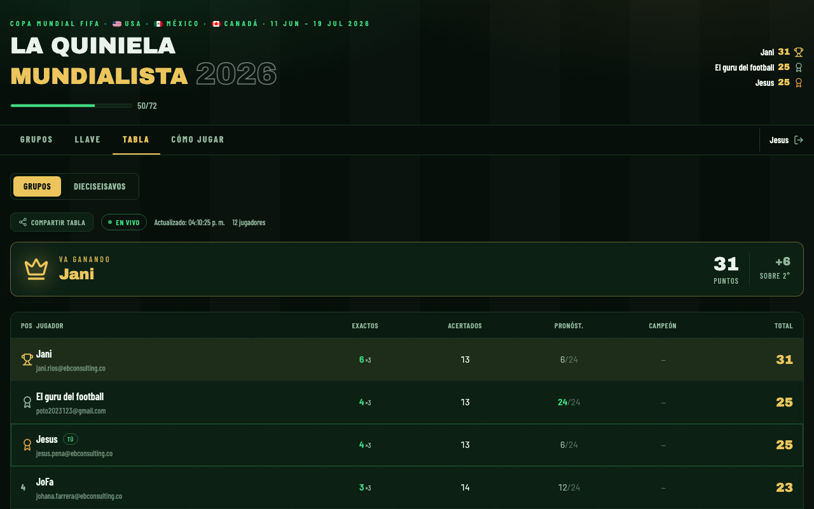
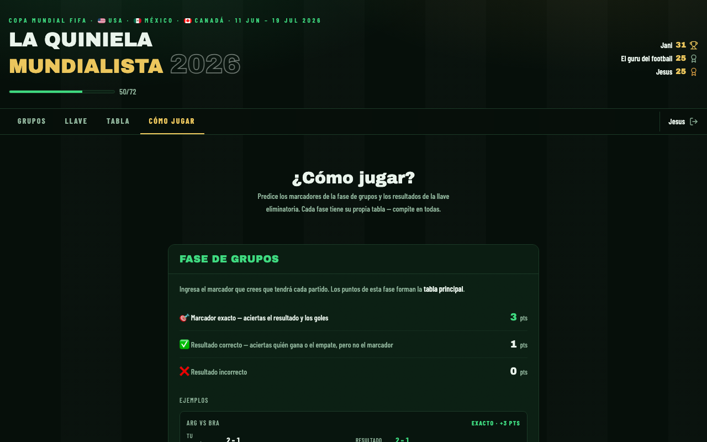
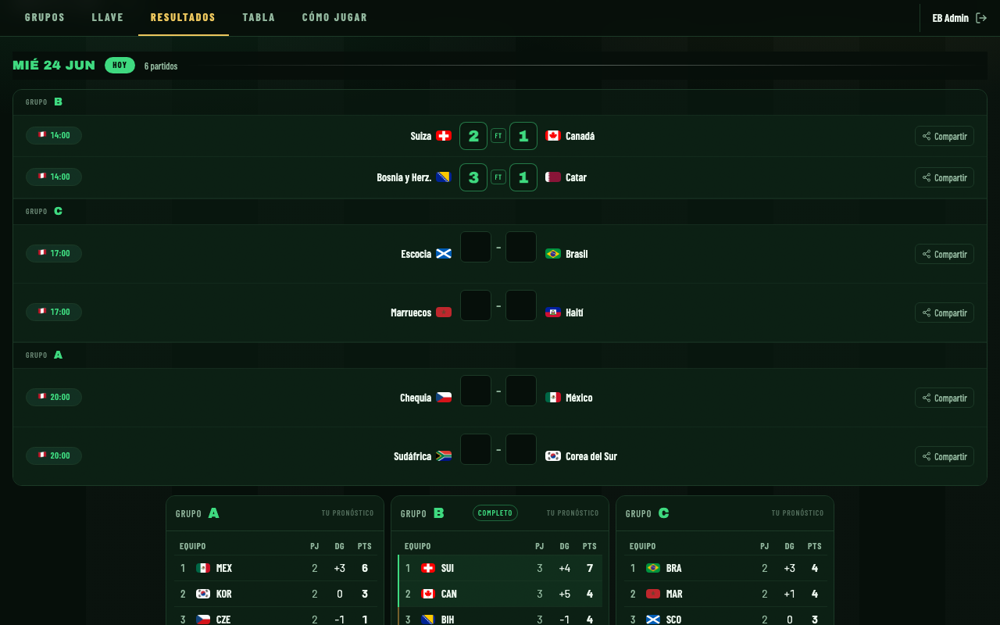

# La Quiniela Mundialista 2026

**v1.0.0** · Tu quiniela del Mundial 2026. Predice, compite con tus amigos y sigue el torneo partido a partido.

**App:** https://jenriqueps.github.io/eb-fifa

---

## El torneo

**Copa Mundial FIFA 2026**  
🇺🇸 USA · 🇲🇽 México · 🇨🇦 Canadá · 11 jun – 19 jul 2026  
48 selecciones · 12 grupos · 104 partidos

---

## Capturas

| Grupos | Llave | Tabla |
|--------|-------|-------|
|  |  |  |

| Cómo Jugar | Admin — Resultados |
|------------|-------------------|
|  |  |

---

## ¿Cómo funciona?

Los participantes entran con un **código de acceso** compartido por el organizador, y luego se registran con email y contraseña. Desde ahí pueden:

- Pronosticar los marcadores de los **72 partidos de fase de grupos**
- Armar su **bracket eliminatorio** partido a partido hasta el campeón — incluyendo prórroga y penales
- Ver el **ranking en tiempo real** contra los demás participantes

Los pronósticos se pueden editar hasta que **el partido inicia** (hora peruana, UTC-5). Una vez que empieza, los inputs se bloquean.

El organizador (admin) ingresa los resultados oficiales — o los sincroniza automáticamente desde football-data.org — y el sistema calcula los puntos. Si dos equipos quedan igualados en la fase de grupos, el admin puede definir el desempate manualmente.

---

## Sistema de puntos

| Acierto | Puntos |
|---------|--------|
| Marcador exacto | **3** |
| Resultado correcto (1X2) | **1** |

Aplica igual en grupos y eliminatorias. En eliminatorias, si el partido va a prórroga o penales también predices esas fases — cada una suma puntos adicionales.

Cada fase del torneo tiene su propia tabla de clasificación — compites por separado en grupos y en cada ronda eliminatoria.

---

## Tecnología utilizada

**Frontend**
- React 18 · Vite 6 · Tailwind CSS 4
- ECharts — gráfica de evolución de puntajes
- Lucide — íconos
- html-to-image — exportar tarjetas para compartir
- XLSX — exportar tabla a Excel

**Backend & servicios**
- Supabase — base de datos, autenticación y tiempo real
- football-data.org — resultados oficiales (sincronización automática para el admin)
- Google Fonts — tipografías Archivo Black y Barlow
- GitHub Pages — hosting y despliegue continuo
