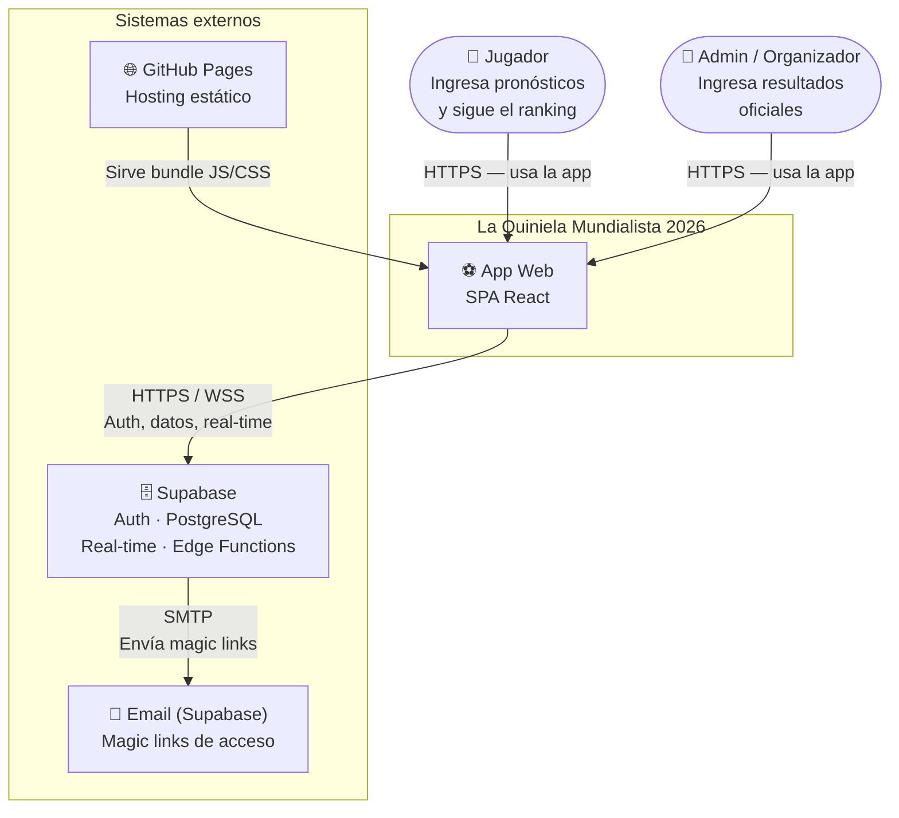
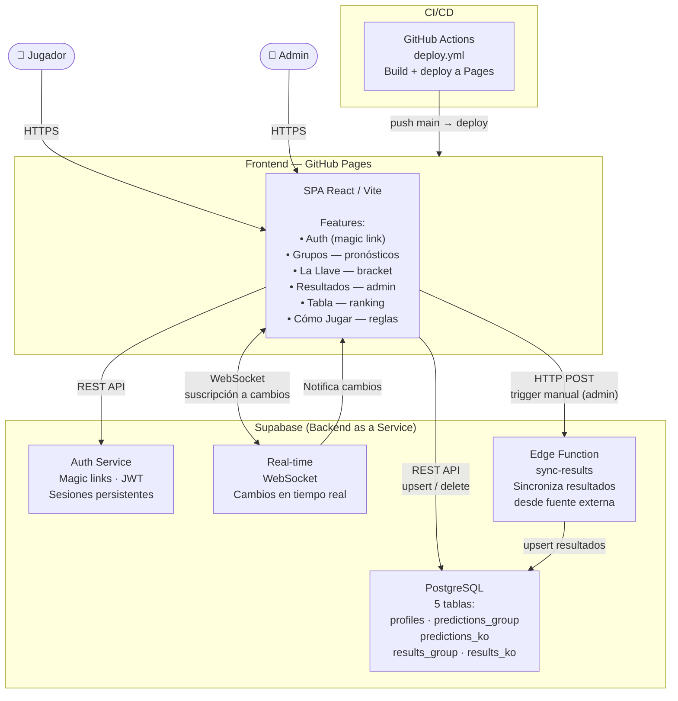

# Arquitectura del Sistema

## C4 — Nivel 1: Contexto

Muestra quiénes interactúan con el sistema y qué sistemas externos involucra.

---

## C4 — Nivel 2: Contenedores

Detalla los componentes internos del sistema y cómo se comunican.

---

## Decisiones de diseño relevantes

| Decisión | Elección | Motivo |
|----------|----------|--------|
| Hosting | GitHub Pages | Gratis, integrado con el repo, sin servidor |
| Backend | Supabase | Auth + DB + real-time en un solo servicio |
| Auth | Magic links (email) | Sin contraseñas, fácil de usar para el equipo |
| Deploy | GitHub Actions | Automatizado al hacer push a `main` |
| Datos estáticos | Archivos JS en el repo | Los fixtures del torneo no cambian |
| Tiempo real | Supabase Realtime (WebSocket) | Ranking actualizado sin recargar |
