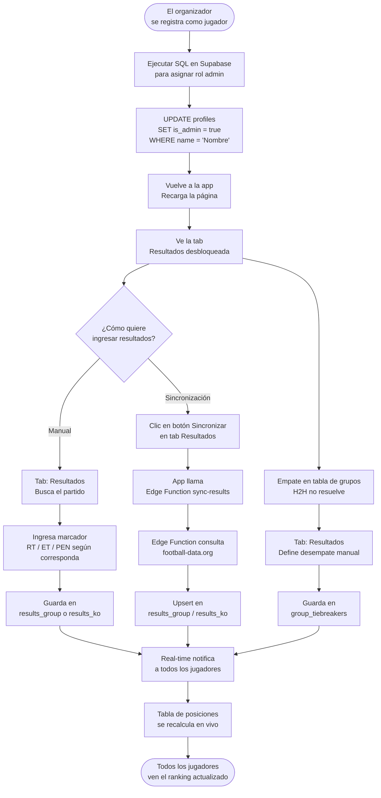
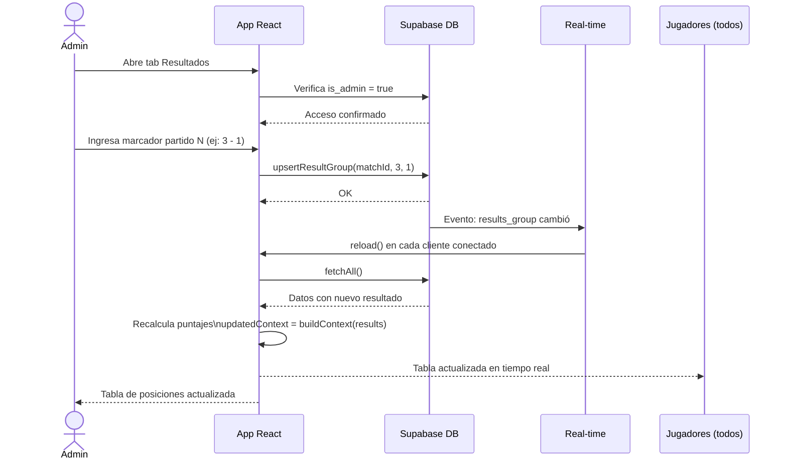
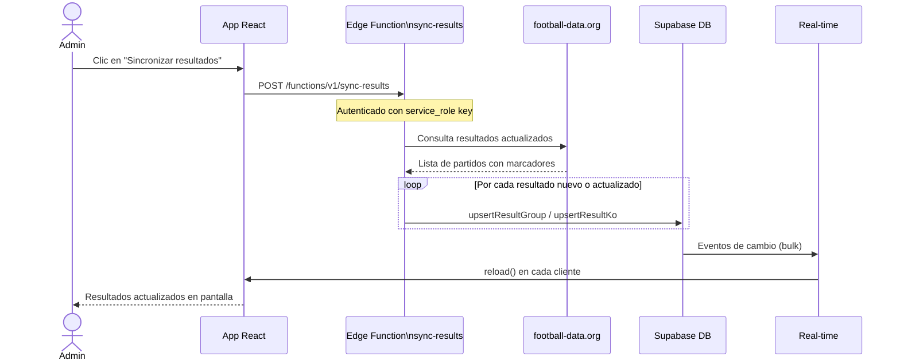

# Flujo del Admin

## Flujo completo del administrador

---

## Flujo de ingreso de resultados (detalle)

---

## Flujo de sincronización automática

---

## Cálculo de puntaje (referencia)

El puntaje se calcula en el frontend (`src/lib/scoring.js`) comparando el pronóstico del jugador contra el resultado oficial.

### Grupos y Eliminatorias — misma regla por fase

| Escenario | Puntos |
|-----------|:------:|
| Marcador exacto (ej. 2-1 vs 2-1) | **3** |
| Resultado correcto, marcador distinto | **1** |
| Resultado incorrecto o sin pronóstico | **0** |

En eliminatorias el jugador pronostica el marcador de **tiempo reglamentario (RT)**. Si el partido va a **prórroga (ET)** también pronostica ese marcador, y si va a **penales (PEN)** también. Cada fase puntúa de forma independiente con la misma regla 3/1.

Cada fase del torneo tiene su **propia tabla de clasificación** — grupos, dieciseisavos, octavos, cuartos, semis y final se computan por separado.
