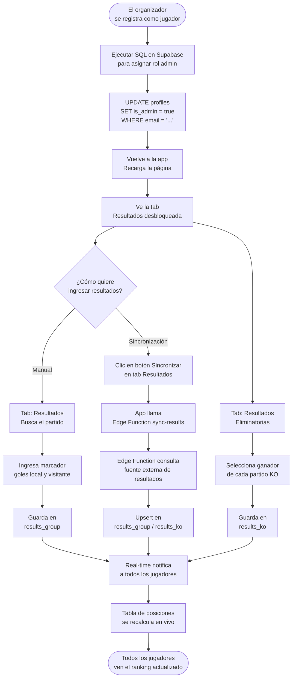
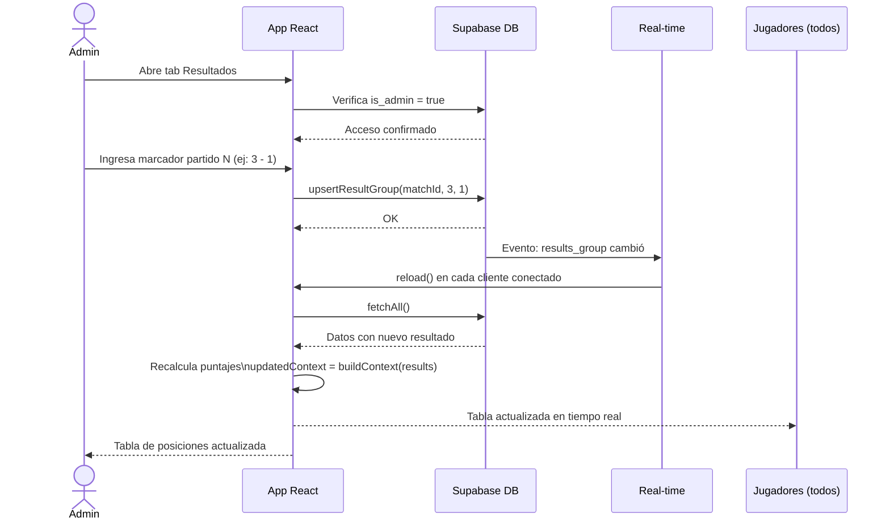
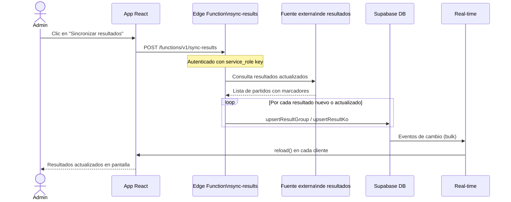

# Flujo del Admin

## Flujo completo del administrador

---

## Flujo de ingreso de resultados (detalle)

---

## Flujo de sincronización automática

---

## Cálculo de puntaje (referencia)

El puntaje se calcula en el frontend (`src/lib/scoring.js`) comparando el pronóstico del jugador contra el resultado oficial:

| Escenario | Puntos |
|-----------|--------|
| Marcador exacto en grupos | 3 |
| Resultado correcto (1X2) sin exacto | 1 |
| Ganador correcto en octavos | 2 |
| Ganador correcto en cuartos | 4 |
| Ganador correcto en semis | 6 |
| Ganador correcto en 3er puesto | 8 |
| Ganador correcto en final | 10 |
| Pronóstico incorrecto o en blanco | 0 |
