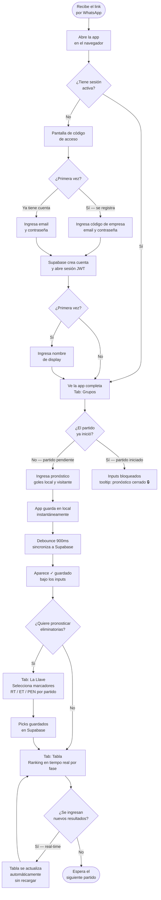
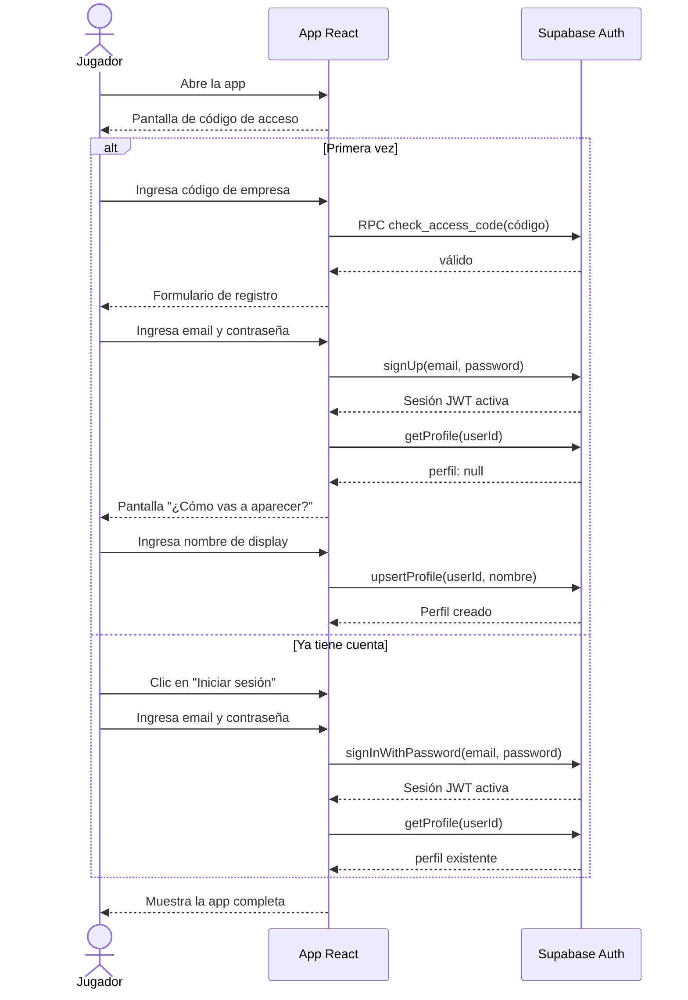
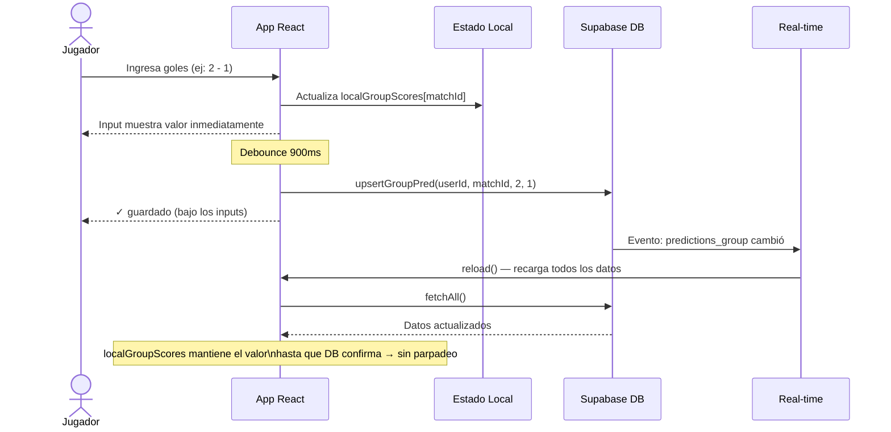

# Flujo del Jugador

## Flujo completo — desde la invitación hasta el ranking

```mermaid
flowchart TD
    A([Recibe el link\npor WhatsApp]) --> B[Abre la app\nen el navegador]
    B --> C{¿Tiene sesión\nactiva?}

    C -->|Sí| H
    C -->|No| D[Pantalla de código\nde acceso]

    D --> D2{¿Primera vez?}
    D2 -->|Sí — se registra| E[Ingresa código de empresa\nemail y contraseña]
    D2 -->|Ya tiene cuenta| E2[Ingresa email\ny contraseña]

    E --> E3[Supabase crea cuenta\ny abre sesión JWT]
    E2 --> E3

    E3 --> G{¿Primera vez?}
    G -->|Sí| H2[Ingresa nombre\nde display]
    G -->|No| H

    H2 --> H[Ve la app completa\nTab: Grupos]

    H --> I{¿El partido\nya inició?}

    I -->|No — partido pendiente| J[Ingresa pronóstico\ngoles local y visitante]
    J --> K[App guarda en local\ninstantáneamente]
    K --> L[Debounce 900ms\nsincroniza a Supabase]
    L --> M[Aparece ✓ guardado\nbajo los inputs]

    I -->|Sí — partido iniciado| N[Inputs bloqueados\ntooltip: pronóstico cerrado 🔒]

    M --> O{¿Quiere pronosticar\neliminatorias?}
    O -->|Sí| P[Tab: La Llave\nSelecciona marcadores\nRT / ET / PEN por partido]
    P --> Q[Picks guardados\nen Supabase]

    O -->|No| R
    Q --> R[Tab: Tabla\nRanking en tiempo real por fase]

    R --> S{¿Se ingresan\nnuevos resultados?}
    S -->|Sí — real-time| T[Tabla se actualiza\nautomáticamente\nsin recargar]
    T --> R
    S -->|No| U([Espera el\nsiguiente partido])
```

---

## Flujo de autenticación (detalle)

```mermaid
sequenceDiagram
    actor U as Jugador
    participant App as App React
    participant SB as Supabase Auth

    U->>App: Abre la app
    App-->>U: Pantalla de código de acceso

    alt Primera vez
        U->>App: Ingresa código de empresa
        App->>SB: RPC check_access_code(código)
        SB-->>App: válido
        App-->>U: Formulario de registro
        U->>App: Ingresa email y contraseña
        App->>SB: signUp(email, password)
        SB-->>App: Sesión JWT activa
        App->>SB: getProfile(userId)
        SB-->>App: perfil: null
        App-->>U: Pantalla "¿Cómo vas a aparecer?"
        U->>App: Ingresa nombre de display
        App->>SB: upsertProfile(userId, nombre)
        SB-->>App: Perfil creado
    else Ya tiene cuenta
        U->>App: Clic en "Iniciar sesión"
        U->>App: Ingresa email y contraseña
        App->>SB: signInWithPassword(email, password)
        SB-->>App: Sesión JWT activa
        App->>SB: getProfile(userId)
        SB-->>App: perfil existente
    end

    App-->>U: Muestra la app completa
```

---

## Flujo de pronóstico (detalle)

```mermaid
sequenceDiagram
    actor U as Jugador
    participant App as App React
    participant Local as Estado Local
    participant SB as Supabase DB
    participant RT as Real-time

    U->>App: Ingresa goles (ej: 2 - 1)
    App->>Local: Actualiza localGroupScores[matchId]
    App-->>U: Input muestra valor inmediatamente

    Note over App: Debounce 900ms
    App->>SB: upsertGroupPred(userId, matchId, 2, 1)
    App-->>U: ✓ guardado (bajo los inputs)

    SB->>RT: Evento: predictions_group cambió
    RT->>App: reload() — recarga todos los datos
    App->>SB: fetchAll()
    SB-->>App: Datos actualizados
    Note over App: localGroupScores mantiene el valor\nhasta que DB confirma → sin parpadeo
```
