# Manual de Usuario — La Quiniela Mundialista 2026

Guía paso a paso para participar en la quiniela del Mundial FIFA 2026.

---

## Para todos

### Cómo ingresar a la app

**Si es tu primera vez:**

1. Abre la URL de la app.
2. Ingresa el **código de acceso** que te dio la empresa y haz click en **Continuar**.
3. Selecciona **Registrarse**, ingresa tu email y una contraseña (mínimo 6 caracteres) y haz click en **Crear cuenta**.
4. La primera vez te pedirá un **nombre de display** — así aparecerás en la tabla de posiciones.

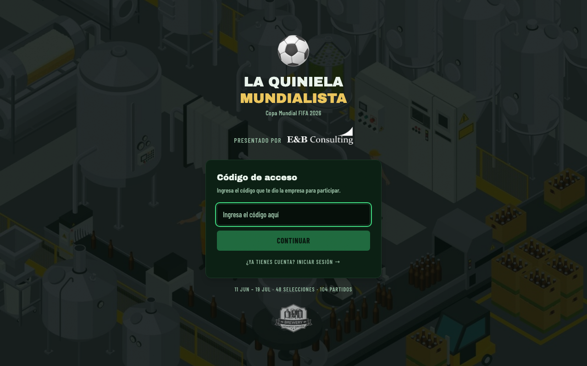

**Si ya tienes cuenta:**

1. Abre la URL de la app.
2. Ingresa tu email y contraseña y haz click en **Entrar**.

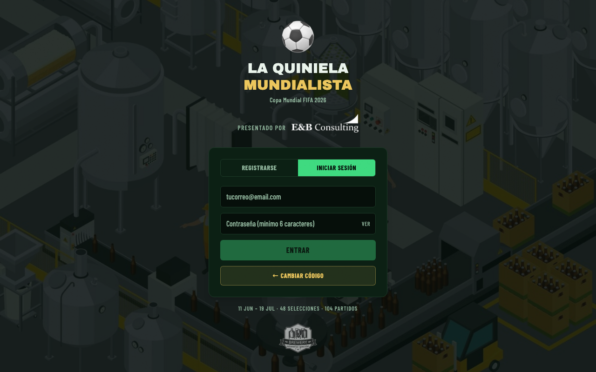

---

### Cómo cambiar tu zona horaria

Los horarios de los partidos se muestran en hora Lima (UTC-5) por defecto. Puedes cambiarlos a tu zona horaria:

1. Ve a la tab **Grupos**.
2. En la barra superior derecha, abre el selector **Hora**.
3. Elige tu país (disponibles: Perú, Colombia, Ecuador, Venezuela, Bolivia, Guyana, Chile, Brasil, Argentina, Uruguay, Paraguay, Surinam).

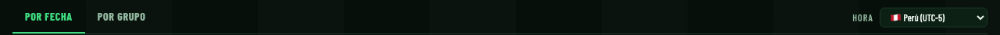

> **Importante:** el cambio de zona horaria solo afecta cómo se muestran los horarios en pantalla. El bloqueo de pronósticos siempre usa la hora real del partido en Lima (UTC-5).

---

## Para Participantes

### Pronosticar partidos de la fase de grupos

1. Ve a la tab **Grupos**.
2. Elige la vista **Por Fecha** (recomendado) o **Por Grupo**.
3. Busca el partido que quieres pronosticar.
4. Ingresa el marcador que predices: goles del equipo local a la izquierda, goles del visitante a la derecha.
5. Tu pronóstico se guarda automáticamente — aparece **"✓ guardado"** debajo del marcador.

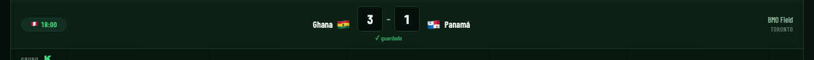

> **Importante:** los inputs se bloquean exactamente cuando el partido inicia. No podrás modificar tu pronóstico después.

**Atajos útiles:**
- La vista **Por Fecha** hace auto-scroll a los partidos de hoy al cargar.
- Las fechas pasadas están colapsadas — haz click en el encabezado de la fecha para expandirlas.

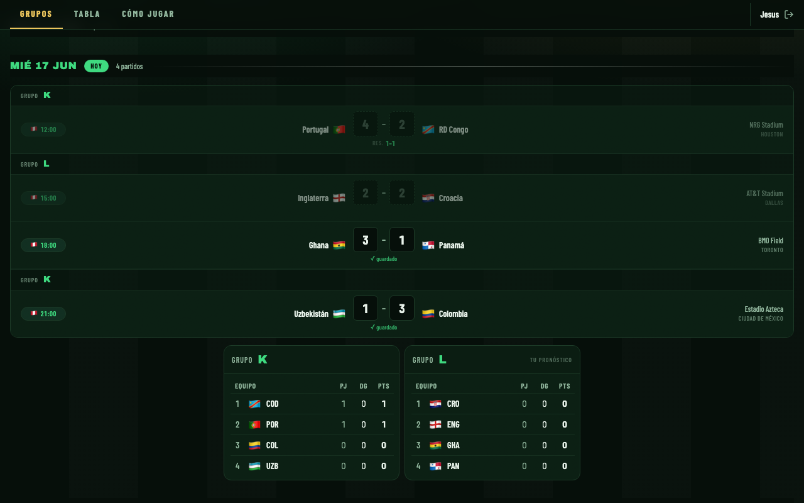

---

### Ver tu progreso

En el **header** de la app hay una barra de progreso verde que muestra cuántos partidos pendientes tienes pronosticados. Por ejemplo: `34/48` significa que has completado 34 de los 48 partidos que aún no han iniciado.

---

### Ver la tabla de posiciones

1. Ve a la tab **Tabla**.
2. La tabla se actualiza en **tiempo real** — cuando el admin ingresa un resultado, los puntos aparecen automáticamente.
3. Tu fila tiene un **borde verde** para identificarte fácilmente.

**Columnas de la tabla:**

| Columna | Qué significa |
|---------|---------------|
| Exactos | Cuántos marcadores predijiste exacto (valen 3 pts c/u) |
| Acertados | Cuántos resultados (ganó/empató/perdió) acertaste (1 pt c/u) |
| Pronóst. | Partidos pendientes que ya pronosticaste / total pendientes |
| Campeón | El equipo que elegiste como campeón del mundo |
| Total | Tu puntuación total |

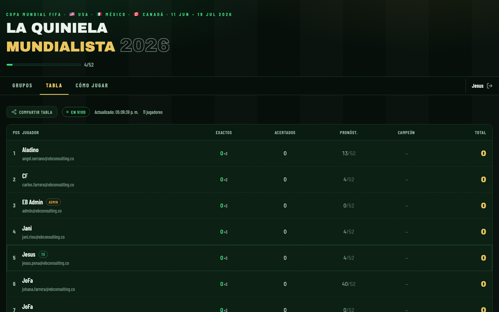

---

### Compartir la tabla de posiciones

1. Ve a la tab **Tabla**.
2. Haz click en el botón **Compartir tabla**.
3. Se abre un preview de la imagen.
4. Haz click en **Descargar** para guardar el PNG y compartirlo por WhatsApp, Slack o email.

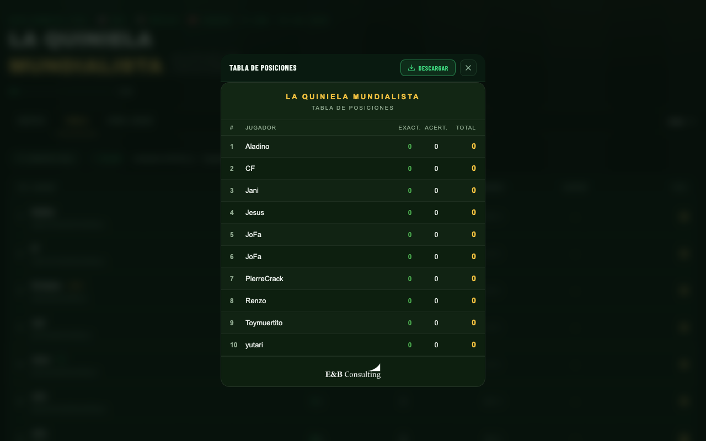

---

### Sistema de puntuación

**Fase de grupos (72 partidos):**

| Tu pronóstico vs Resultado real | Puntos |
|---------------------------------|:------:|
| Marcador exacto (ej. predijiste 2-1 y salió 2-1) | **+3** |
| Resultado correcto pero marcador diferente (ej. 3-1 y salió 2-1) | **+1** |
| Resultado incorrecto | **0** |
| No pronosticaste y hay resultado | **0** |

> **Tip:** los marcadores exactos valen 3 veces más que solo acertar el resultado. Vale la pena arriesgar un marcador específico.

**Máximo posible:** 338 puntos (216 en grupos + 122 en eliminatorias).

Para ver las reglas completas con ejemplos, ve a la tab **Cómo Jugar**.

---

## Para Admin

> La tab **Resultados** solo es visible para cuentas con rol de admin. Si necesitas acceso, contacta al organizador.

### Ingresar resultados oficiales

1. Ve a la tab **Resultados** → sub-tab **Ingresar Resultados**.
2. Busca el partido terminado.
3. Ingresa el marcador oficial en los inputs del partido.
4. El resultado se guarda automáticamente y la tabla de posiciones de todos los jugadores se actualiza en tiempo real.

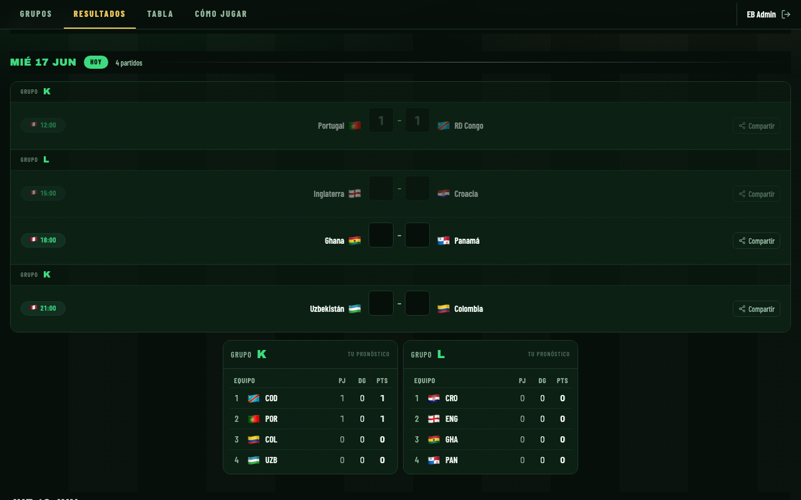

---

### Sincronizar resultados desde la API

En lugar de ingresar marcadores manualmente, puedes importarlos automáticamente:

1. Ve a la tab **Resultados** → sub-tab **Ingresar Resultados**.
2. Haz click en el botón **Sincronizar** (ícono de flechas circulares).
3. La app consulta football-data.org y actualiza todos los partidos con marcadores finales disponibles.
4. Aparece un mensaje con cuántos partidos se sincronizaron y cuáles no se encontraron.

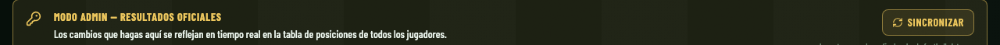

> **Nota:** la sincronización solo actualiza partidos que ya terminaron. Los partidos en curso o futuros no se modifican.

---

### Ver los pronósticos de un participante

1. Ve a la tab **Resultados** → sub-tab **Pronósticos**.
2. Selecciona un jugador en el dropdown.
3. Se muestra una tabla con todos sus pronósticos, el resultado oficial y los puntos que obtuvo.

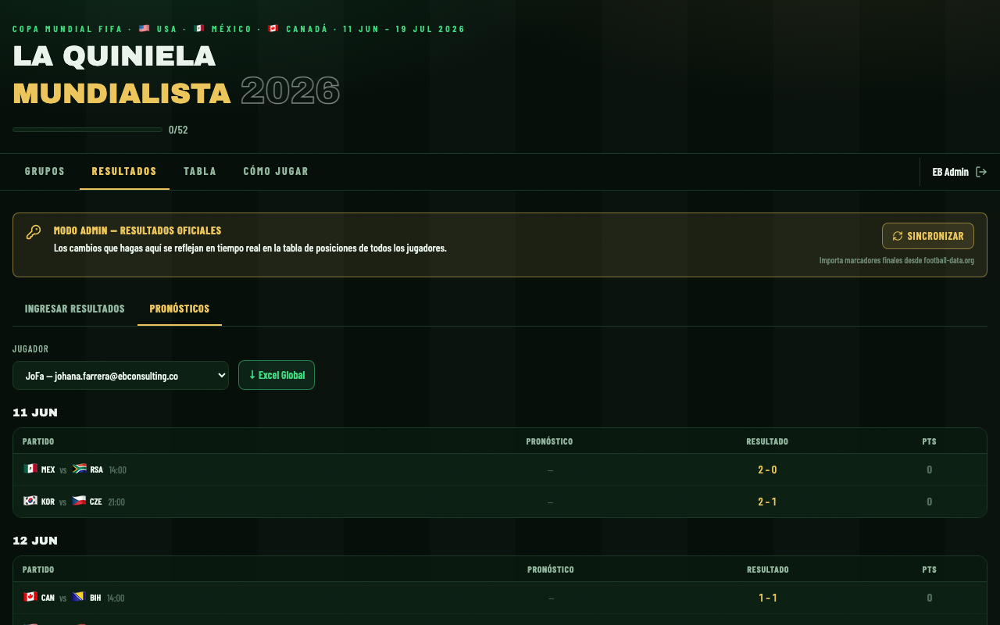

**Colores de puntos:**
- Verde **+3** — marcador exacto
- Ámbar **+1** — resultado correcto
- Gris **0** — incorrecto o sin pronóstico

---

### Descargar Excel global

Exporta todos los pronósticos y resultados en un solo archivo:

1. Ve a la tab **Resultados** → sub-tab **Pronósticos**.
2. Haz click en el botón **↓ Excel Global**.
3. Se descarga `quiniela-mundialista-2026.xlsx` con una hoja por jugador.

Cada hoja contiene: Fecha · Hora · Grupo · Local · Visitante · Pronóstico · Resultado · Puntos.

---

### Compartir los pronósticos de un partido como imagen

1. Ve a la tab **Resultados** → sub-tab **Ingresar Resultados**.
2. Busca el partido que quieres compartir y haz click en el botón **Compartir** (ícono de compartir).
3. Se abre un preview con la imagen: header de la quiniela, equipos, resultado oficial y pronósticos de todos los participantes.
4. Haz click en **Descargar** para guardar el PNG.

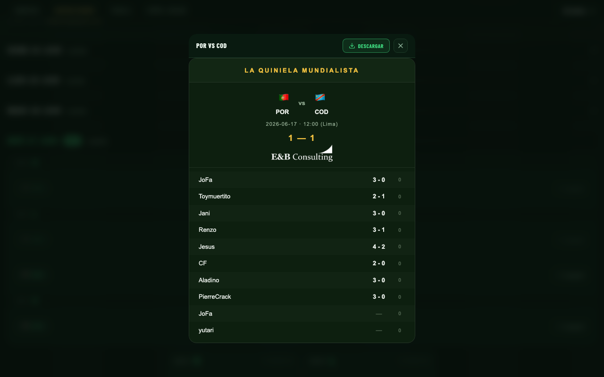

> **Nota:** los usuarios admin no aparecen en la imagen compartida.

---

### Compartir la tabla de posiciones

Igual que los participantes:

1. Ve a la tab **Tabla**.
2. Haz click en **Compartir tabla** → **Descargar**.

---

### Cómo hacer una cuenta admin

Requiere acceso al dashboard de Supabase:

1. Ir al dashboard de Supabase → Table Editor → tabla `profiles`.
2. Buscar el usuario por nombre o email.
3. Cambiar el campo `is_admin` de `false` a `true`.
4. Guardar. El usuario verá la tab **Resultados** en su próxima recarga.
