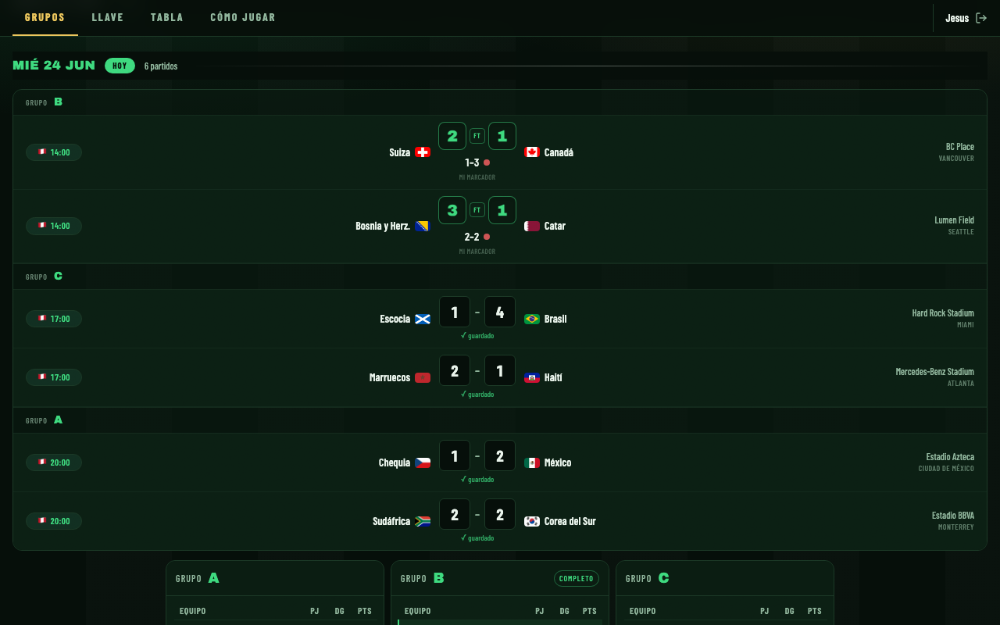
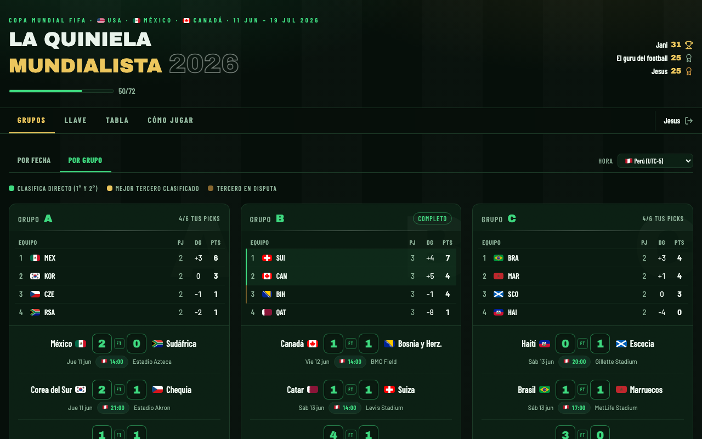

# La Quiniela Mundialista 2026 — Product Overview

## ¿Qué es?

La Quiniela Mundialista 2026 es una aplicación web interna de EB Consulting para que los colaboradores pronostiquen los resultados del Mundial FIFA 2026 (USA · México · Canadá, 11 jun – 19 jul). Los participantes predicen marcadores de los 72 partidos de grupos y los ganadores de los 32 partidos de eliminatorias. Un ranking en tiempo real muestra quién va liderando a lo largo del torneo.

El acceso está protegido por un código de empresa. Todos los datos se persisten en Supabase (PostgreSQL + Auth + Realtime). La app se despliega como SPA estática en GitHub Pages.

**Stack:** React 18 + Vite + Tailwind CSS v4 · Supabase (Auth, DB, Realtime, RLS) · GitHub Pages (CI/CD via GitHub Actions)

---

## Roles

| Capacidad | Participante | Admin |
|-----------|:-----------:|:-----:|
| Pronosticar partidos de grupos | ✓ | ✓ |
| Ver tabla de posiciones en tiempo real | ✓ | ✓ |
| Cambiar zona horaria de display | ✓ | ✓ |
| Compartir tabla como imagen | ✓ | ✓ |
| Ver reglas y sistema de puntuación | ✓ | ✓ |
| Ver tab "Resultados" | — | ✓ |
| Ingresar resultados oficiales | — | ✓ |
| Sincronizar desde football-data.org | — | ✓ |
| Ver pronósticos de todos los jugadores | — | ✓ |
| Descargar Excel global de pronósticos | — | ✓ |
| Compartir imagen de pronósticos por partido | — | ✓ |

---

## Funcionalidades

### Autenticación

- **Código de acceso** — primer paso para usuarios nuevos. El código se valida contra la tabla `access_codes` via RPC `check_access_code` (SECURITY DEFINER). El código nunca viaja al bundle del cliente.
- **Registro** — email + password vía Supabase Auth. El código de acceso se re-valida en el submit para evitar bypass desde el frontend.
- **Login** — los usuarios ya registrados van directo al form de inicio de sesión.
- **Nombre de display** — al ingresar por primera vez se solicita un nombre que aparecerá en la tabla de posiciones y en las imágenes compartidas.

---

### Tab: Grupos (Pronósticos)

Principal área de interacción del participante. Permite pronosticar los 72 partidos de la fase de grupos.

**Dos vistas:**

#### Por Fecha
- Partidos agrupados cronológicamente. La fecha de hoy (o la más próxima) recibe auto-scroll al cargar.
- Fechas pasadas están colapsadas por defecto para reducir el scroll.
- Cada fecha muestra: hora, equipos, inputs de marcador, resultado oficial (si ya existe), estadio y tablas de posiciones de cada grupo presente en esa fecha.

#### Por Grupo
- 12 tarjetas (Grupos A–L), cada una con tabla de posiciones y los 6 partidos del grupo.
- La tabla se calcula en tiempo real con los pronósticos del usuario (o resultados oficiales si ya existen).

**Inputs de marcador:**
- Se guardan automáticamente con un debounce de 900 ms.
- Se bloquean exactamente cuando el partido inicia (hora Lima UTC-5) sin necesidad de recargar la página — un timer calcula el próximo kickoff y fuerza un re-render.

**Selector de zona horaria:**
- Dropdown en la barra superior de la tab.
- Convierte los horarios de Lima (UTC-5) a cualquiera de 12 zonas horarias de Sudamérica.
- Persiste en `localStorage`. El bloqueo de inputs siempre usa hora Lima como referencia objetiva.

---

### Tab: Resultados (solo Admin)

Los usuarios no admin ven un mensaje de acceso restringido con instrucciones.

#### Sub-tab: Ingresar Resultados
- Misma UI de grupos, pero edita los resultados oficiales en lugar de pronósticos del usuario.
- Un banner dorado identifica el modo admin.
- **Botón Sincronizar** — llama a la Edge Function proxy que consulta football-data.org, actualiza todos los marcadores finales y reporta cuántos se sincronizaron.
- **Botón Compartir** en cada partido — genera una imagen PNG con los pronósticos de todos los participantes para ese partido (via `html-to-image`, sin backend). Muestra un preview modal antes de descargar.

#### Sub-tab: Pronósticos
- Dropdown para seleccionar un jugador.
- Tabla con todos sus pronósticos, el resultado oficial y los puntos obtenidos (+3 / +1 / 0).
- **Botón Excel Global** — descarga un archivo `.xlsx` con una hoja por jugador (cliente, sin backend, via SheetJS).

---

### Tab: Tabla (Leaderboard)

Ranking en tiempo real de todos los jugadores.

- **Destacado del líder** — tarjeta con corona, nombre, puntos y ventaja sobre el segundo.
- **Indicador de conexión** — badge verde pulsante ("En vivo") o ámbar ("Reconectando…") según el estado del canal Supabase Realtime.
- **Tabla de posiciones** — columnas: Pos · Jugador · Exactos · Acertados · Pronóst. · Campeón · Total.
  - Top 3 muestran íconos de trofeo/medalla cuando hay resultados.
  - La fila del usuario autenticado tiene borde verde.
  - Usuarios admin tienen badge "admin".
- **Botón Compartir tabla** — descarga imagen PNG del ranking sin columnas de pronóstico ni campeón, con logo EB Consulting.

---

### Tab: Cómo Jugar

Documento de reglas accesible desde la app:

- **Fase de grupos:** exacto = 3 pts · resultado correcto = 1 pt · incorrecto = 0 pts.
- **Eliminatorias:** misma regla, aplicada a RT / ET / PEN por separado.
- Ejemplos ilustrados con marcadores reales.
- Cada fase tiene su propia tabla de clasificación.
- Consejos para maximizar puntos.

---

### Header (persistente)

| Elemento | Descripción |
|----------|-------------|
| Título | "LA QUINIELA MUNDIALISTA 2026" |
| Barra de progreso | Partidos pendientes pronosticados / total pendientes |
| Podio top 3 | Nombres + puntos + íconos de medalla, actualizado en tiempo real |
| Chip de campeón | Bandera + nombre del equipo elegido como campeón del mundo |

### Nav sticky

Muestra el nombre del usuario autenticado y el botón de logout. Se mantiene visible al hacer scroll.

---

## Sistema de puntuación

### Fase de grupos (72 partidos · máx. 216 pts)

| Resultado | Puntos |
|-----------|:------:|
| Marcador exacto (ej. 2-1 vs 2-1) | **3** |
| Resultado correcto, marcador distinto (ej. 2-1 vs 3-1) | **1** |
| Resultado incorrecto | **0** |
| Sin pronóstico cuando hay resultado | **0** |

### Eliminatorias (32 partidos)

Misma regla que grupos: exacto = 3 pts · resultado correcto = 1 pt.

El jugador pronostica el marcador de **tiempo reglamentario (RT)**. Si el partido va a prórroga, también pronostica **ET**; si va a penales, también **PEN**. Cada fase puntúa de forma independiente.

Cada ronda eliminatoria tiene su **propia tabla de clasificación** — dieciseisavos, octavos, cuartos, semis y final se computan por separado.

### Desempate en la tabla

1. Total de puntos
2. Marcadores exactos
3. Resultados correctos (1X2)
4. Nombre alfabético

---

## Arquitectura

Para detalles técnicos ver:
- [architecture/overview.md](../architecture/overview.md) — diagramas C4
- [adr/README.md](../adr/README.md) — decisiones de arquitectura (7 ADRs)
- [reference/er-diagram.md](./er-diagram.md) — modelo de datos
